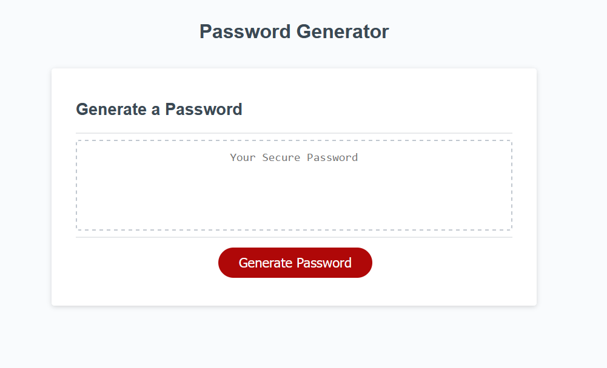

# Password-generator
A website to randomly generate a password that provides a strong security.

## Description
-HTML
-CSS
-Java Script

## Table of contents
-Installation
-Usage
-Deployed Application
-License

## Installation
- Clone this repository(https://github.com/KritiShrestha/Password-generator) to your local machine 
- Open the project in VS code or any other IDEs
- Run index.html in the live server. This will open the webpage in the browser

## Usage
It wil help users to generate a secure password with the kind of characters that they would like to select with.
Here's the screen shot of the wepage when opened -

## Deployed Application
Here's the link to the deployed application - https://kritishrestha.github.io/Password-generator/

## License
MIT
